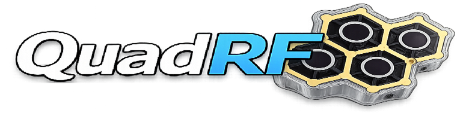
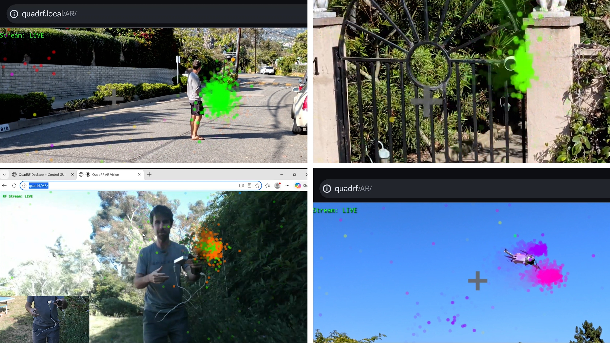

**QuadRF** is a 4x4 MIMO SDR tile for spatial RF vision and beamforming that scales as a phased array

QuadRF democratizes modern phased array technology, bringing it down to Earth in an accessible, hacker-friendly, and programmable kit. At its core, QuadRF is a modular 4x4 MIMO software-defined radio tile with an open antenna architecture. Powered by an integrated Raspberry Pi 5, it functions out of the box as a real-time RF camera, expanding SDR exploration from the traditional time and frequency domains into the **spatial domain**.

While a single QuadRF is a complete, fully functional phased array development platform, it is also designed from the ground up as a building block for much larger arrays. Beamforming computation is distributed across each tile's Lattice ECP5 FPGA, meaning users can link boards together to scale into square-meter scale phased arrays, such as our open-source 240-antenna MoonRF design. To support builders looking to scale their arrays, we will also be offering individual RF tiles after the campaign.

## Applications

QuadRF lets you directly explore the RF environment around you.  See where signals are, the way they propagate, and how antennas and the surrounding environment interact. At 30 fps, you can instantly map WiFi devices in a room, track quadcopters in the sky, or see wireless transmitters through walls. Expanding beyond vision and LiDAR, your robots or drones can use QuadRF to gain real-time spatial awareness of surrounding radio beacons and access points for localization.

QuadRF is also a powerful diagnostic tool for engineers and hardware developers to debug their own RF products. You can use it to see exactly where a device is radiating or how signals change with an enclosure. Because QuadRF is full-duplex, it doesn’t just listen—it can also transmit probe signals to measure a spatial response. This allows users to characterize shadowing, absorption, reflections, material polarization effects, and general RF channels throughout the environment. For educators, QuadRF is a practical, hands-on teaching tool for university students learning about MIMO, phased arrays, and spatial wireless measurements.

To take this into the field, the included tripod converts into a mobile carry handle. It features an integrated smartphone holder that perfectly aligns your phone's camera with the QuadRF array, allowing you to easily utilize augmented reality (AR) visualization on the go.

As a complete, full-duplex (Tx+Rx) SDR featuring dual-polarization (RHCP and LHCP) antennas, it expands the capabilities of software-defined radio. Its four coherent transceivers unlock true 4x4 MIMO, and can automatically beamform and maximize signal-to-noise ratios (SNR) over extreme distances—perfect for locating, tracking, and streaming HD video from moving quadcopters or balloons. Experiment with point-to-point links, point-to-multipoint architectures, and spatial mesh-network prototyping. Out of the box, it integrates directly into your existing workflow, ready to run popular frameworks like GNU Radio, SoapySDR, or your own custom RF code.

## Features & Specifications

**RF & Wireless Capabilities**
* 4 RX / 4 TX full-duplex coherent channels.
* Operating frequency range of 4.9 - 6.0 GHz (C-Band).
* 40 MHz of bandwidth per antenna.
* 1 Watt Tx power per antenna utilizing four SiGe power amplifiers.
* Four swappable dual-polarization (RHCP and LHCP) antennas.

**Compute & Processing**
* Integrated Raspberry Pi 5 for onboard computation and control.
* Lattice ECP5 FPGA (LFE5U-45F-7BG256I) for distributed DSP and beamforming.
* Analog Devices MAX2850 4-channel Upconvert Mixer and MAX2851 4-channel Downconvert Mixer.
* High-throughput MIPI data path between the RF FPGA and the Linux Pi 5 host.

**Connectivity, Power & Interfaces**
* USB 3.0, Gigabit Ethernet, Wi-Fi, and Direct HDMI/USB support.
* Custom circular USB-C power splitter with integrated ESD protection.
* **Optional Mobile Pack:** A separate add-on featuring a back-mountable battery bank for 21700 Lithium batteries, providing 5-6 hours of mobile use (Rx only) or 3-4 hours under 100% Tx load.

**Physical Properties**
* Custom 3D-printed magnetic enclosure utilizing transparent 8001 resin.
* Includes convertible desktop/mobile-carry tripod with an aligned smartphone holder for AR applications.
* **Dimensions:** 15 x 11 x 4 cm (5.9 x 4.3 x 1.6 inches)
* **Weight:**
  * QuadRF Tile + antenna: 35 g (1.2 oz)
  * QuadRF Kit with enclosure: 190 g (6.7 oz)
  * Complete kit (with all accessories, tripod, power supply): 670 g (1.48 lbs)

**Software & Ecosystem**
* Out-of-the-box Web RF GUI, Web Remote Desktop, and Direct Pi 5 Linux access.
* Compatible with GNU Radio, SoapySDR, and ZeroMQ.

## Open Source

QuadRF uses a hybrid open model. We have open-sourced the elements where users are most likely to modify, extend, and build, while protecting the RF-core implementation that makes a low-cost 4x4 MIMO SDR tile possible.

* **Software, Drivers, and Applications:** The entire QuadRF software stack is 100% open-source under GPLv2/GPLv3. This includes Linux drivers, SoapySDR support, control APIs, calibration utilities, web interfaces, and example applications.
* **Antenna and Array Ecosystem:** The antenna and mechanical ecosystem is fully open-source under CC BY-SA 4.0. We publish the 4-element, 72-element, and 240-element FR4 antenna PCB CAD/Gerbers, OpenEMS simulation files, and MoonRF array structure CAD.
* **FPGA Customization:** The onboard Lattice ECP5 FPGA is unlocked and user-programmable. It can be programmed directly from the Raspberry Pi 5 using OpenOCD or through standard JTAG tools.
* **Protected RF Core:** The production RF-core and official factory DSP bitstreams are proprietary. However, we provide source-available RF schematics for debugging, education, and academic research.

**Accessing the Files**
All open-source software files and schematics are available right now. Antenna design files and simulations to be opened before the campaign completes.
* **Software & Hardware Files:** Access our repositories on our [GitHub page](https://github.com/open-space-sdr/main).
* **Documentation:** Read the full setup and customization guides at [moonrf.com/docs](https://moonrf.com/docs/).

## Legal

This repository contains released MoonRF and related Scale RF antenna and mechanical design files. Scale RF's goal is to make the released antenna ecosystem useful to makers, researchers, hams, educators, and commercial users while preserving a reciprocal defensive patent framework and protecting the QuadRF RF Board / Tile and other RF-core designs.

### Community use

We want QuadRF and MoonRF to be something the community can actually learn from, modify, build, and use.

The released MoonRF antenna and mechanical design files are available under Creative Commons Attribution-ShareAlike 4.0 International (`CC BY-SA 4.0`), which lets you copy, share, and adapt those files for any purpose, including commercial use, subject to attribution and ShareAlike.

Because CC BY-SA 4.0 does not license patent rights, Scale RF also provides a royalty-free defensive patent covenant so makers, researchers, hams, and commercial users can make, have made, use, modify, sell, offer for sale, import, and distribute hardware based on the released antenna design, subject to the covenant's defensive terms. The covenant also includes a design-limited reciprocal patent grant and defensive non-assert from recipients who claim, invoke, rely on, or receive the benefit of the Scale RF patent covenant. See [`PATENT_COVENANT.md`](PATENT_COVENANT.md).

The antenna patent covenant applies only to the Released Antenna Design. It does not grant permission to manufacture, reproduce, clone, sell, or distribute the QuadRF RF Board, QuadRF RF Tile, RF transceiver core, RF-board layouts, Gerbers, BOMs, FPGA designs, internal calibration systems, or other protected Scale RF RF-core materials.

For commercial manufacture, sale, distribution, crowdfunding, fulfillment, or other commercial hardware distribution based on the released antenna design, Scale RF requires explicit signed acceptance of the patent covenant and reciprocal patent grant. A short-form acceptance template is provided in [`PATENT_COVENANT_ACCEPTANCE_AGREEMENT.md`](PATENT_COVENANT_ACCEPTANCE_AGREEMENT.md). This acceptance requirement does not modify or restrict rights granted under CC BY-SA 4.0 for the released design files.

### What is released

The exact files included in each release are identified in [`RELEASE_MANIFEST.md`](RELEASE_MANIFEST.md) and by the corresponding repository release tag or commit hash.

Unless otherwise stated in the release manifest, the released antenna design files may include antenna PCB source files, CAD files, Gerbers, manufacturing drawings, mechanical drawings, simulation files, documentation, and related design outputs for the released antenna and mechanical structures.

### What is not released by this repository

Unless expressly stated in the release manifest or in another written license from Scale RF, this repository does not license or release Scale RF's:

- the QuadRF RF Board, QuadRF RF Tile, RF transceiver core, or physical RF-core products;
- RF-board layouts, Gerbers, manufacturing outputs, bills of materials, stackups, pick-and-place files, or production-test materials;
- RF-core schematics, except for selected debugging/reference schematic files if expressly listed and marked with a file-level license;
- digital electronics designs;
- FPGA designs;
- calibration systems;
- phased-array control systems;
- test systems;
- manufacturing processes;
- enclosure designs;
- unreleased system designs or methods;
- trademarks, logos, product names, branding, or trade dress.

Purchase of a Scale RF product is governed by the applicable product terms and does not grant permission to manufacture, copy, clone, or redistribute protected Scale RF RF-core products or unreleased designs.

### QuadRF RF Board / Tile schematic clarification

The QuadRF RF Board / Tile and related RF-core technology are all rights reserved and patent pending. Scale RF may provide selected schematics, diagrams, pinouts, or debugging notes for troubleshooting and review. If those files are expressly marked CC BY-SA 4.0, that license applies only to copyright and similar rights in the schematic or documentation files themselves. It does not grant a patent license, manufacturing license, or other right to manufacture, have manufactured, reproduce as physical hardware, copy, clone, sell, offer for sale, import, or distribute QuadRF RF Boards, RF Tiles, replacement boards, compatible boards, or derivative RF-core products. See [`RF_BOARD_AND_TILE_NOTICE.md`](RF_BOARD_AND_TILE_NOTICE.md).

### Third-party attribution

Some released antenna features are based in part on other open source projects. See [`THIRD_PARTY_NOTICES.md`](THIRD_PARTY_NOTICES.md) for upstream attribution, license information, and related notices.

### Trademarks

No trademark license is granted by this repository. See [`TRADEMARKS.md`](TRADEMARKS.md) for permitted nominative references and restrictions on use of ScaleRF, QuadRF, MoonRF, and related marks.

### Safety, RF compliance, export, and lawful use

The released files are not a certified radio product, approved transmitter, or authorization to transmit radio-frequency energy in any jurisdiction. High-power RF systems, amplifiers, phased arrays, and directional antennas can create RF-exposure, interference, thermal, electrical, and regulatory risks.

Anyone who builds, sells, modifies, installs, connects, transmits with, imports, exports, or operates hardware based on these files is responsible for all required engineering review, testing, licensing, equipment authorization, RF-exposure evaluation, emissions compliance, safe installation, export/import compliance, sanctions compliance, and lawful operation.

See:

- [`SAFETY_AND_REGULATORY_NOTICE.md`](SAFETY_AND_REGULATORY_NOTICE.md)
- [`EXPORT_AND_SANCTIONS_NOTICE.md`](EXPORT_AND_SANCTIONS_NOTICE.md)
- [`NO_WARRANTY_AND_DISCLAIMER.md`](NO_WARRANTY_AND_DISCLAIMER.md)
- [`RF_BOARD_AND_TILE_NOTICE.md`](RF_BOARD_AND_TILE_NOTICE.md)

### Contributions

Scale RF may accept issue reports, documentation improvements, and other contributions, but substantial antenna-design, RF, calibration, mechanical, manufacturing, or software contributions may require a separate contributor agreement. See [`CONTRIBUTING.md`](CONTRIBUTING.md).

### Contact

For patent licensing, patent-covenant acceptance, commercial collaboration, trademark permission, safety/regulatory questions, or questions about this release, contact:

`legal@scalerf.com`
